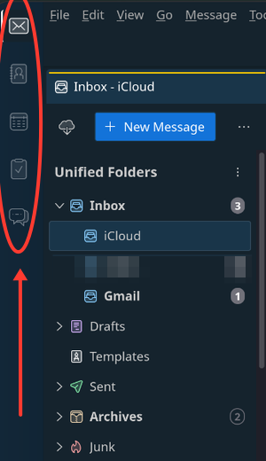
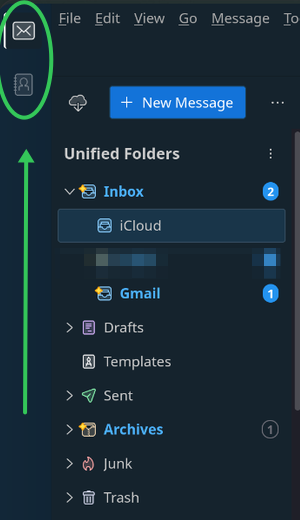
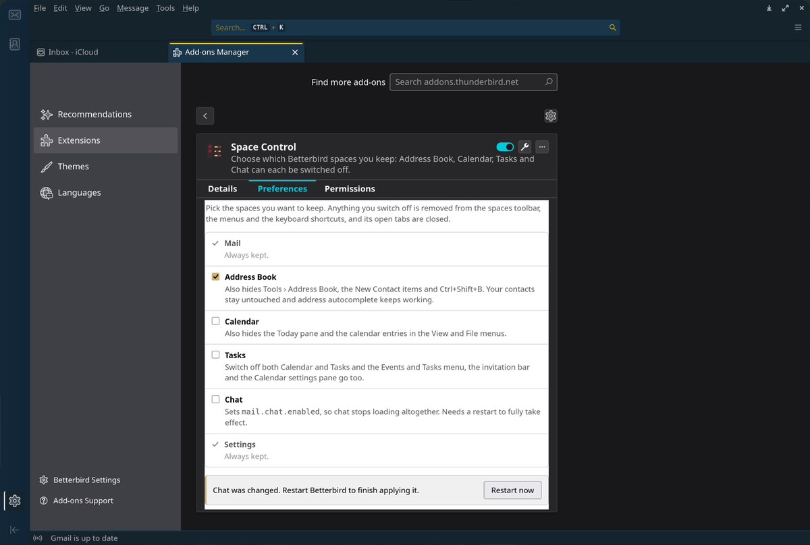

# Space Control (Thunderbird/Betterbird Add-on)

A Betterbird/Thunderbird MailExtension that lets you choose which spaces you
keep. Address Book, Calendar, Tasks and Chat can each be switched off; Mail and
Settings always stay.

Switching a space off removes it from the spaces toolbar and the pinned-spaces
menu, hides its menu entries and toolbar buttons, disables its keyboard
shortcuts, and closes any of its tabs that are open (including ones that come
back through session restore).

Verified on **Betterbird 140.13.0esr-bb25** (Thunderbird 140 ESR) and
**Thunderbird 153.0.1** — see [Compatibility](#compatibility).

## What it looks like

The spaces toolbar with everything switched on, and with Calendar, Tasks and
Chat switched off — Address Book kept:

<table>
<tr><th align="left">Before</th><th align="left">After</th></tr>
<tr valign="top">
<td></td>
<td></td>
</tr>
</table>

Picking what to keep, from **Tools → Space Control…**:



## How it works

WebExtension APIs cannot touch the main window UI, so the add-on ships a small
Experiment API (`api/implementation.js`) that runs with chrome privileges:

- **CSS.** One user stylesheet, registered through `nsIStyleSheetService`, whose
  text is generated from the current settings. Selectors are qualified with XUL
  element names or scoped to a chrome container, because the sheet is global.
- **`hidden` attribute.** The spaces toolbar filters its arrow-key navigation on
  `[hidden]` rather than on CSS, so the six spaces buttons and their pinned-menu
  twins are hidden the way Thunderbird itself hides them when chat is off.
  Otherwise keyboard focus would land on an invisible button.
- **Prefs.** `mail.chat.enabled` is Thunderbird's real off switch for chat and is
  set from the panel. Switching both Calendar and Tasks off also sets
  `calendar.itip.showImipBar` to false so invitations stop appearing in the
  message pane.
- **Tab monitor.** A tabmail monitor closes tabs of switched-off spaces as they
  open, which is what makes session restore behave.
- **Tools menu.** The API adds a "Space Control…" item to the Tools menu that
  jumps straight to the options panel, because the Add-ons Manager route
  (detail view -> Preferences tab) is easy to conclude does not exist.

Turning both Calendar and Tasks off additionally applies Thunderbird's own
`.hide-when-calendar-deactivated` class — the marker it uses for its "no
calendars enabled" state — so calendar surfaces that have no obvious ID are
covered too, along with the Calendar pane in Settings.

Chat is the only space that needs a restart, because it only loads or unloads at
startup. The options panel says so and offers a restart button.

Disabling or uninstalling the add-on undoes everything, including the two prefs.

## Install

Download the `.xpi` from [Releases](https://github.com/davidboulay/thunderbird-space-control/releases),
or build it yourself:

```sh
./build.sh               # produces dist/space-control@davidboulay.xpi
./build.sh --update      # replaces an already-installed copy, then restart
```

For a first install, use *Add-ons and Themes → gear → Install Add-on From File*.
Do **not** just drop the XPI into the profile's `extensions/` directory:
Thunderbird treats that as a side-load, re-applies
`extensions.autoDisableScopes` on every start, and keeps switching the add-on
back off.

Both `extensions.experiments.enabled` and `xpinstall.signatures.required`
already default the right way in Betterbird 140 (true and false respectively),
so no pref changes are needed.

Then open **Tools → Space Control…** and pick your spaces. Nothing is hidden
until you switch something off.

## Layout

| Path | What it is |
| --- | --- |
| `manifest.json` | MV2 manifest, declares the `spaceControl` experiment |
| `background.js` | Reads `storage.local` and applies it on startup and on change |
| `api/schema.json` | API surface: `apply`, `getStatus`, `restart` |
| `api/implementation.js` | The chrome-privileged half |
| `options/` | The settings panel shown in the Add-ons Manager |

## Compatibility

Declared range: **140.0 – 153.\***.

Everything this add-on hides is addressed by element ID, and a stale ID fails
silently — the CSS rule simply stops matching, nothing throws. So the range is
only ever as wide as what has actually been checked. Both ends were verified by
extracting `omni.ja` and confirming that every referenced ID, `item-id`, class,
`<key>` and tab mode still exists, then running the add-on and confirming it
really hid things:

| | Betterbird 140.13.0esr | Thunderbird 153.0.1 |
| --- | --- | --- |
| All 45 references present | yes | yes |
| Spaces buttons hidden at runtime | yes | yes |
| Shortcut keys disabled | yes | yes |
| Tools menu entry added | yes | yes |
| Prefs applied | yes | yes |

Nothing changed between those two versions, which is a good sign for the
releases in between, though they were not individually tested. To widen the
range further, re-run the checks in
[If a Betterbird update breaks it](#if-a-betterbird-update-breaks-it) first.

Thunderbird does not require add-ons to be signed on any channel
(`MOZ_REQUIRE_SIGNING` is off and `xpinstall.signatures.required` defaults to
false), so installing the XPI straight from Releases is a normal, supported
thing to do — not a workaround.

### The Experiment API deprecation

Thunderbird plans to stop honouring Experiment APIs on the **Release** channel,
gated by `extensions.experiments.suppressed` plus an
`extensions.experiments.allowed` allow-list. In shipped 153.0.1 those are
`false` and `"tbpro-add-on@thunderbird.net,owl@beonex.com"` respectively, so
experiments still work today. The switch was announced for 153, then delayed by
a year to target the 2027 ESR
([bug 2042677](https://bugzilla.mozilla.org/show_bug.cgi?id=2042677) is still
open). When it flips, this add-on stops working on Release and keeps working on
ESR, Beta and Daily — and on Betterbird, which tracks ESR.

## Publishing status

Thunderbird add-ons are listed on [ATN](https://addons.thunderbird.net), not on
addons.mozilla.org. A listing is not currently an option: ATN has paused review
of **new** submissions that use Experiment APIs, reportedly until around the
2027 ESR. Updates to already-listed experiment add-ons still get reviewed.

If that reopens, two things need attention first, both from the ATN
[review policy](https://thunderbird.github.io/atn-review-policy/) and
[reviewer guide](https://addons-reviewer-guide.thunderbird.net/add-on-review-guide):

- **"No Surprises."** Changing `mail.chat.enabled` counts as changing
  Thunderbird's defaults, so it must be opt-in, named in the UI that requests it,
  and stated in the listing description. It already is opt-in — nothing changes
  until a box is unticked — and the pref is restored on uninstall.
- **No re-implementing built-ins.** Reviewers reject custom experiments that
  duplicate existing APIs, and prefer the shared `LegacyCSS` and `LegacyPrefs`
  experiments over hand-rolled equivalents. The stylesheet and pref handling here
  would likely need to move onto those.

## Traps that cost real time

- **`onStartup()` is mandatory.** The manifest declares `events: ["startup"]`,
  and `SchemaAPIManager.onStartup` in `ExtensionCommon.sys.mjs` calls
  `api.onStartup()` without checking that it exists — and `ExtensionAPI` does
  not define it. Omit the method and the call throws inside the startup promise
  chain, leaving the add-on **enabled but inert**: listed in the Add-ons Manager
  with a UUID allocated, but no options panel and nothing applied. Nothing is
  logged where you would look. This was the 1.0.0 bug.
- **A same-version XPI swap runs the old code** for that whole session. Bump the
  version when testing, or expect a two-restart cycle.
- **`-headless` cannot verify much**: `runtime.openOptionsPage()` fails there,
  and extension console output does not reach stdout even with
  `devtools.console.stdout.chrome`. Probe with
  `Services.prefs.setStringPref` from the parent script and read `prefs.js`
  afterwards, or watch for a real side effect such as
  `calendar.itip.showImipBar`.

## If an update breaks it

Everything hangs off element IDs read out of `omni.ja`. To re-check them after a
major version bump:

```sh
# Betterbird flatpak, or org.mozilla.thunderbird / thunderbird_esr
unzip -o ~/.local/share/flatpak/app/eu.betterbird.Betterbird/current/active/files/lib/betterbird/omni.ja -d /tmp/omni
grep -n "Button\|menuitem:" /tmp/omni/chrome/messenger/content/messenger/spacesToolbar.js
grep -rn "hide-when-calendar-deactivated" /tmp/omni/chrome/
```

Then confirm at runtime rather than trusting the greps, because a missing ID is
silent. Install into a throwaway profile with a config that switches everything
off, and check that the add-on actually acted:

```sh
P=/tmp/tb-test; mkdir -p "$P/extensions" "$P/browser-extension-data/space-control@davidboulay"
printf 'user_pref("extensions.autoDisableScopes", 0);\nuser_pref("extensions.webextensions.ExtensionStorageIDB.enabled", false);\n' > "$P/user.js"
cp dist/space-control@davidboulay.xpi "$P/extensions/space-control@davidboulay.xpi"
echo '{"spaces":{"addressbook":false,"calendar":false,"tasks":false,"chat":false}}' \
  > "$P/browser-extension-data/space-control@davidboulay/storage.js"
timeout 60 flatpak run org.mozilla.thunderbird -headless -no-remote -profile "$P"
grep -E "mail.chat.enabled|showImipBar" "$P/prefs.js"   # both present = it ran
```

## License

MIT — see [LICENSE](LICENSE).
